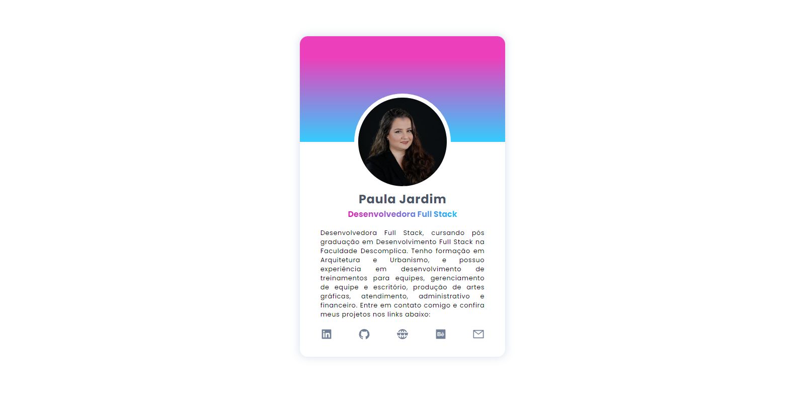
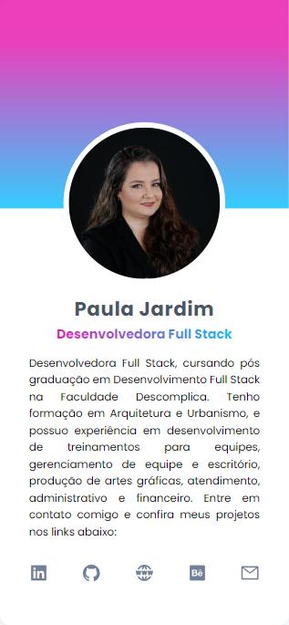

# Profile Card Paula Jardim

Card pessoal responsivo com links de redes sociais e portfólio.

# Índice

* [Tecnologias usadas](#tecnologias-usadas)
* [Imagem do projeto](#imagem-do-projeto)
* [Deploy](#deploy)
* [Rodando o Projeto](#rodando-o-projeto)

## Tecnologias usadas:

- ``React.js``
- ``Vite.js``
- ``SASS``

## Imagem do projeto:

## Deploy:

- ``Vercel`` | Link: <https://links-paulajardim.vercel.app/>

## Rodando o projeto:
- Rode o console na pasta em que você baixou os arquivos;

- Insira o comando ``npm install``;

- Depois, o comando ``npm run dev`` para rodar no navegador.

## Autora:

<table>
  <tr>
    <td align="center">
      <a href="https://github.com/paulajardimf">
         
        
          <b>Paula Jardim</b>
        
      </a>
    </td>
  </tr>
</table>